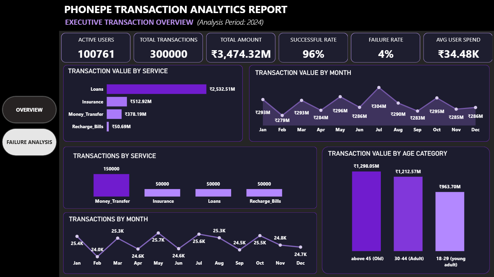
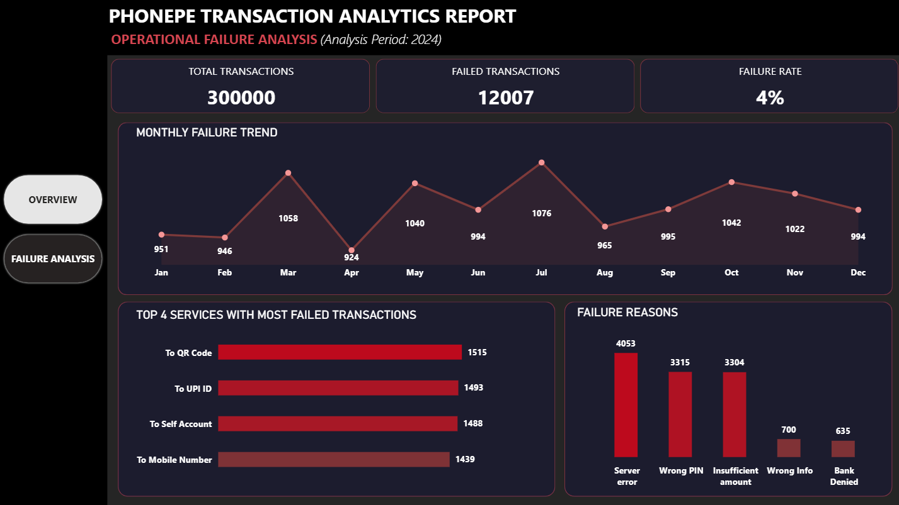

 #  PhonePe Transaction Analytics Report

An interactive **Power BI dashboard** built to analyze PhonePe transaction data, monitor business performance, identify transaction trends, and investigate payment failures. The report provides actionable insights through KPIs, interactive visualizations, and operational analytics.

---

##  Project Overview

This project analyzes **300,000 PhonePe transactions** to understand customer activity, transaction performance, transaction value, and payment failures. The dashboard is designed to help business stakeholders monitor key metrics and identify operational issues affecting digital payment services.

The report consists of two interactive dashboards:

- 📊 Executive Transaction Overview
- 🚨 Operational Failure Analysis

---

##  Business Problem

Digital payment platforms generate millions of transactions every day. Business teams need a centralized dashboard to monitor:

- Overall transaction performance
- Transaction value across different services
- Monthly transaction trends
- Customer spending behavior
- Payment success and failure rates
- Major reasons behind failed transactions

The objective is to convert raw transaction data into meaningful business insights that support data-driven decision making.

---

##  Dataset

The project uses two datasets:

### All_Transactions
Contains transaction-level information:

- Transaction ID
- User ID
- Transaction Amount
- Service
- Service Type
- Payment Status
- Failure Reason
- Transaction Date

### All_Users
Contains customer information:

- User ID
- Age
- Registration Date

**Analysis Period:** **2024**

---

## 🛠 Tools & Technologies

- Power BI Desktop
- Power Query
- DAX
- Microsoft Excel

---

# 📊 Dashboard 1 — Executive Transaction Overview

### KPIs

- Active Users
- Total Transactions
- Total Transaction Value
- Successful Rate
- Failure Rate
- Average User Spend

### Visualizations

- Transaction Value by Service
- Transaction Value by Month
- Transactions by Service
- Transaction Value by Age Category
- Monthly Transaction Trend

---

# 🚨 Dashboard 2 — Operational Failure Analysis

### KPIs

- Total Transactions
- Failed Transactions
- Failure Rate

### Visualizations

- Monthly Failure Trend
- Top 4 Services with Most Failed Transactions
- Failure Reasons

---

#  Dashboard Preview

## Executive Transaction Overview

---

## Operational Failure Analysis

---

# 📈 Key Insights

### Executive Transaction Overview

- Processed **300,000** transactions during the analysis period.
- Total transaction value exceeded **₹3.47 Billion**.
- The platform achieved a **96% transaction success rate**.
- More than **100K active users** completed transactions.
- Average spending per active user was approximately **₹34.48K**.
- **Loans** generated the highest transaction value.
- **Money Transfer** recorded the highest transaction volume.
- Transaction value peaked during **July**.
- Users aged **45 years and above** generated the highest transaction value.

---

### Operational Failure Analysis

- Total failed transactions reached **12,007**.
- Overall failure rate remained low at **4%**.
- **July** recorded the highest number of failed transactions.
- **Server Error** was the leading cause of transaction failures.
- **Wrong PIN** was the second most common failure reason.
- **QR Code** transactions experienced the highest number of failed transactions among all service types.

---

# 💡 Business Recommendations

- Improve server infrastructure to reduce failures caused by server errors.
- Optimize QR Code payment processing to minimize failed transactions.
- Implement proactive validation to reduce Wrong PIN and Wrong Info errors.
- Notify users about insufficient balance before payment initiation.
- Continuously monitor monthly failure trends to identify recurring operational issues.
- Focus on high-value services such as Loans to maximize transaction value while maintaining system reliability.

---

# 📚 Skills Demonstrated

- Data Cleaning using Power Query
- Data Transformation
- Data Modeling
- DAX Measures
- KPI Design
- Dashboard Design
- Data Visualization
- Business Intelligence
- Analytical Thinking
- Interactive Reporting

---

# 🚀 Future Improvements

- Add Year and Service slicers for enhanced interactivity.
- Build a dedicated Customer Insights dashboard.
- Include drill-through pages for service-level analysis.
- Integrate live data using SQL Server or Azure.
- Publish the report to the Power BI Service.

---

## 👨‍💻 Author

**Abhijith P Anil**

---

⭐ If you found this project useful or interesting, feel free to star the repository!
